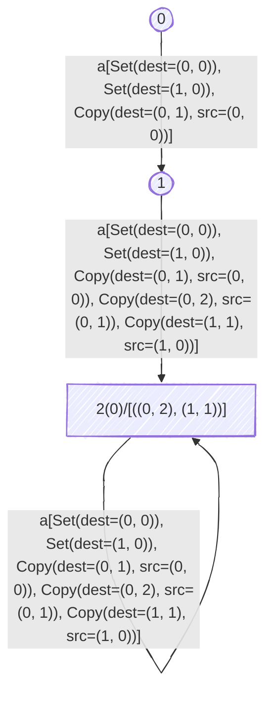

```mermaid
---
  config:
    look: handDrawn
---
graph TD
0-->|"a[Set(dest=(0, 0)), Set(dest=(1, 0)), Copy(dest=(0, 1), src=(0, 0))]"|1
1-->|"a[Set(dest=(0, 0)), Set(dest=(1, 0)), Copy(dest=(0, 1), src=(0, 0)), Copy(dest=(0, 2), src=(0, 1)), Copy(dest=(1, 1), src=(1, 0))]"|2
2-->|"a[Set(dest=(0, 0)), Set(dest=(1, 0)), Copy(dest=(0, 1), src=(0, 0)), Copy(dest=(0, 2), src=(0, 1)), Copy(dest=(1, 1), src=(1, 0))]"|2
0((0))
1((1))
2["2(0)/[((0, 2), (1, 1))]"]
```
