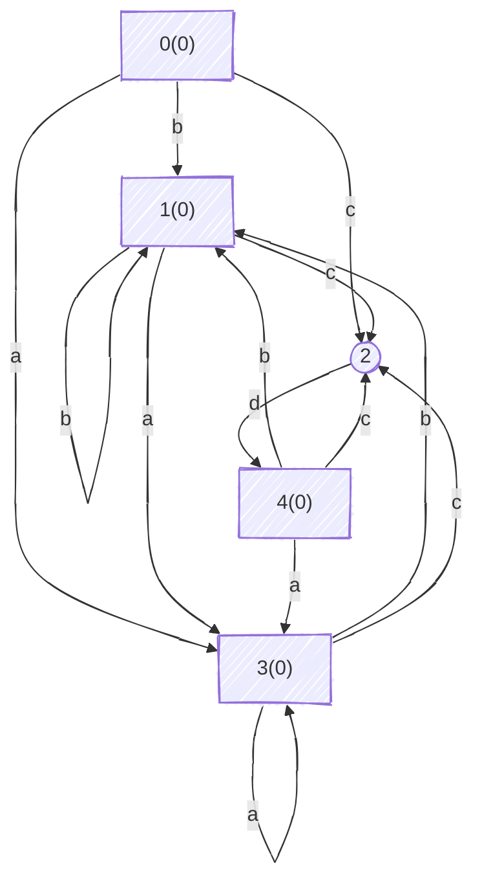

```mermaid
---
  config:
    look: handDrawn
---
graph TD
0-->|"b"|1
0-->|"c"|2
0-->|"a"|3
1-->|"b"|1
1-->|"c"|2
1-->|"a"|3
2-->|"d"|4
3-->|"b"|1
3-->|"c"|2
3-->|"a"|3
4-->|"b"|1
4-->|"c"|2
4-->|"a"|3
0["0(0)"]
1["1(0)"]
2((2))
3["3(0)"]
4["4(0)"]
```
