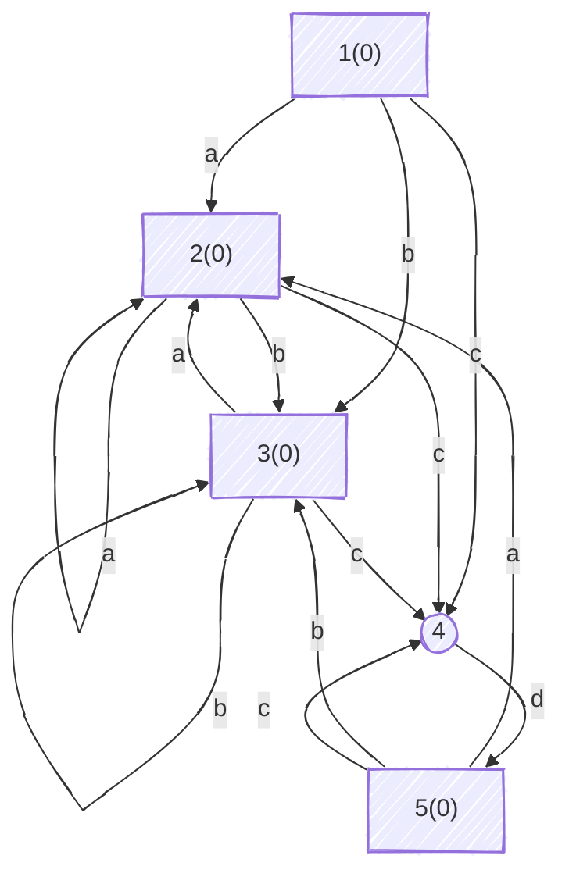

```mermaid
---
  config:
    look: handDrawn
---
graph TD
1-->|"a"|2
1-->|"b"|3
1-->|"c"|4
2-->|"a"|2
2-->|"b"|3
2-->|"c"|4
3-->|"a"|2
3-->|"b"|3
3-->|"c"|4
4-->|"d"|5
5-->|"a"|2
5-->|"b"|3
5-->|"c"|4
1["1(0)"]
2["2(0)"]
3["3(0)"]
4((4))
5["5(0)"]
```
