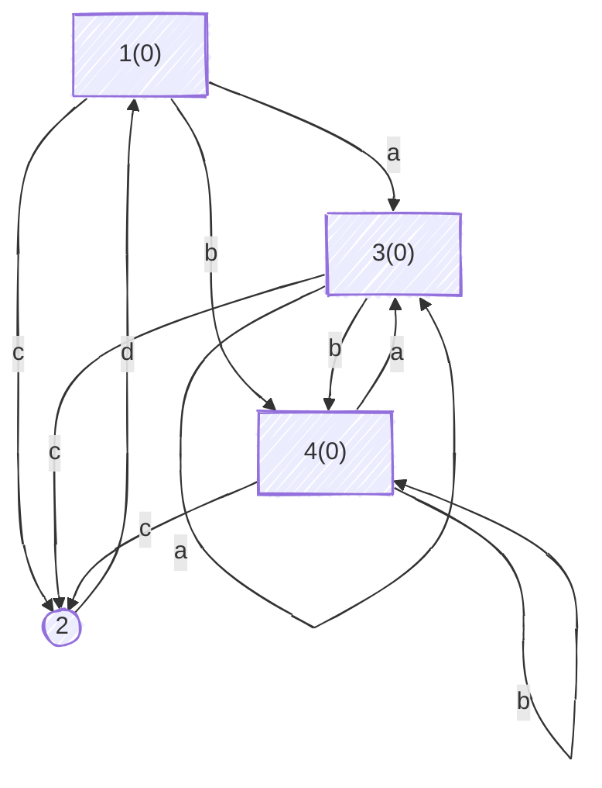

```mermaid
---
  config:
    look: handDrawn
---
graph TD
1-->|"c"|2
1-->|"a"|3
1-->|"b"|4
2-->|"d"|1
3-->|"c"|2
3-->|"a"|3
3-->|"b"|4
4-->|"c"|2
4-->|"a"|3
4-->|"b"|4
1["1(0)"]
2((2))
3["3(0)"]
4["4(0)"]
```
