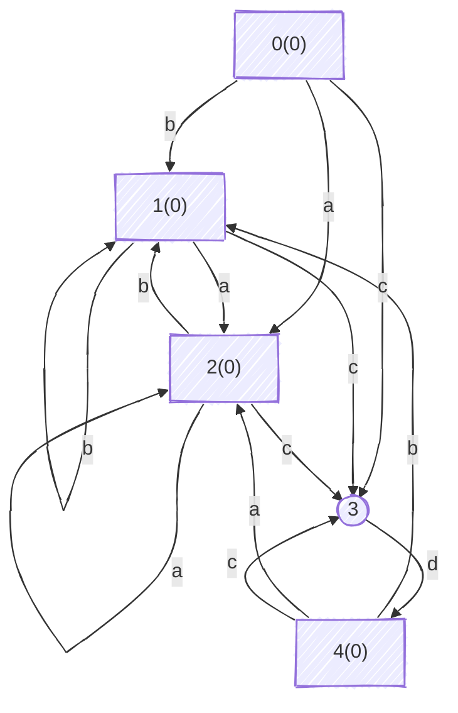

```mermaid
---
  config:
    look: handDrawn
---
graph TD
0-->|"b"|1
0-->|"a"|2
0-->|"c"|3
1-->|"b"|1
1-->|"a"|2
1-->|"c"|3
2-->|"b"|1
2-->|"a"|2
2-->|"c"|3
3-->|"d"|4
4-->|"b"|1
4-->|"a"|2
4-->|"c"|3
0["0(0)"]
1["1(0)"]
2["2(0)"]
3((3))
4["4(0)"]
```
