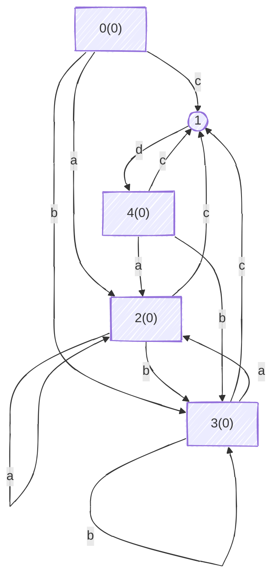

```mermaid
---
  config:
    look: handDrawn
---
graph TD
0-->|"c"|1
0-->|"a"|2
0-->|"b"|3
1-->|"d"|4
2-->|"c"|1
2-->|"a"|2
2-->|"b"|3
3-->|"c"|1
3-->|"a"|2
3-->|"b"|3
4-->|"c"|1
4-->|"a"|2
4-->|"b"|3
0["0(0)"]
1((1))
2["2(0)"]
3["3(0)"]
4["4(0)"]
```
