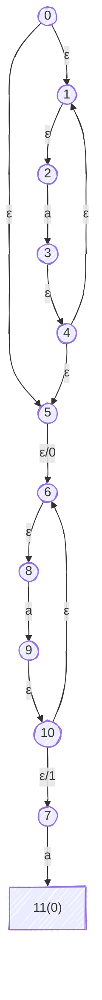

```mermaid
---
  config:
    look: handDrawn
---
graph TD
0-->|"ε"|1
0-->|"ε"|5
1-->|"ε"|2
2-->|"a"|3
3-->|"ε"|4
4-->|"ε"|1
4-->|"ε"|5
5-->|"ε/0"|6
6-->|"ε"|8
7-->|"a"|11
8-->|"a"|9
9-->|"ε"|10
10-->|"ε"|6
10-->|"ε/1"|7
0((0))
1((1))
2((2))
3((3))
4((4))
5((5))
6((6))
7((7))
8((8))
9((9))
10((10))
11["11(0)"]
```
