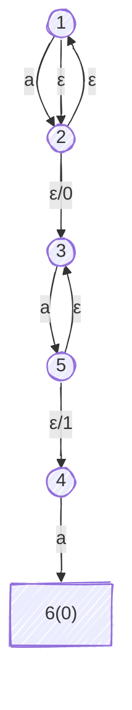

```mermaid
---
  config:
    look: handDrawn
---
graph TD
1-->|"a"|2
1-->|"ε"|2
2-->|"ε"|1
2-->|"ε/0"|3
3-->|"a"|5
4-->|"a"|6
5-->|"ε"|3
5-->|"ε/1"|4
1((1))
2((2))
3((3))
4((4))
5((5))
6["6(0)"]
```
