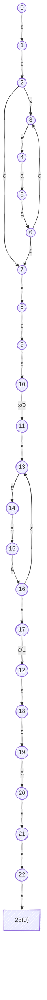

```mermaid
---
  config:
    look: handDrawn
---
graph TD
0-->|"ε"|1
1-->|"ε"|2
2-->|"ε"|3
2-->|"ε"|7
3-->|"ε"|4
4-->|"a"|5
5-->|"ε"|6
6-->|"ε"|3
6-->|"ε"|7
7-->|"ε"|8
8-->|"ε"|9
9-->|"ε"|10
10-->|"ε/0"|11
11-->|"ε"|13
12-->|"ε"|18
13-->|"ε"|14
14-->|"a"|15
15-->|"ε"|16
16-->|"ε"|13
16-->|"ε"|17
17-->|"ε/1"|12
18-->|"ε"|19
19-->|"a"|20
20-->|"ε"|21
21-->|"ε"|22
22-->|"ε"|23
0((0))
1((1))
2((2))
3((3))
4((4))
5((5))
6((6))
7((7))
8((8))
9((9))
10((10))
11((11))
12((12))
13((13))
14((14))
15((15))
16((16))
17((17))
18((18))
19((19))
20((20))
21((21))
22((22))
23["23(0)"]
```
