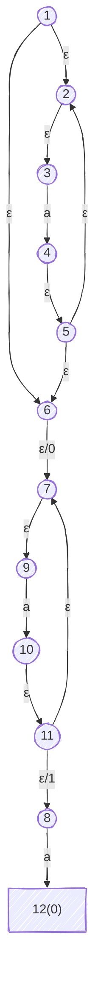

```mermaid
---
  config:
    look: handDrawn
---
graph TD
1-->|"ε"|2
1-->|"ε"|6
2-->|"ε"|3
3-->|"a"|4
4-->|"ε"|5
5-->|"ε"|2
5-->|"ε"|6
6-->|"ε/0"|7
7-->|"ε"|9
8-->|"a"|12
9-->|"a"|10
10-->|"ε"|11
11-->|"ε"|7
11-->|"ε/1"|8
1((1))
2((2))
3((3))
4((4))
5((5))
6((6))
7((7))
8((8))
9((9))
10((10))
11((11))
12["12(0)"]
```
