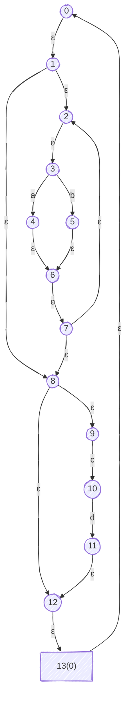

```mermaid
---
  config:
    look: handDrawn
---
graph TD
0-->|"ε"|1
1-->|"ε"|2
1-->|"ε"|8
2-->|"ε"|3
3-->|"a"|4
3-->|"b"|5
4-->|"ε"|6
5-->|"ε"|6
6-->|"ε"|7
7-->|"ε"|2
7-->|"ε"|8
8-->|"ε"|9
8-->|"ε"|12
9-->|"c"|10
10-->|"d"|11
11-->|"ε"|12
12-->|"ε"|13
13-->|"ε"|0
0((0))
1((1))
2((2))
3((3))
4((4))
5((5))
6((6))
7((7))
8((8))
9((9))
10((10))
11((11))
12((12))
13["13(0)"]
```
