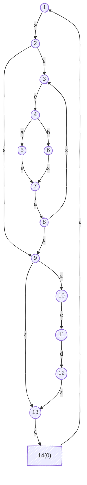

```mermaid
---
  config:
    look: handDrawn
---
graph TD
1-->|"ε"|2
2-->|"ε"|3
2-->|"ε"|9
3-->|"ε"|4
4-->|"a"|5
4-->|"b"|6
5-->|"ε"|7
6-->|"ε"|7
7-->|"ε"|8
8-->|"ε"|3
8-->|"ε"|9
9-->|"ε"|10
9-->|"ε"|13
10-->|"c"|11
11-->|"d"|12
12-->|"ε"|13
13-->|"ε"|14
14-->|"ε"|1
1((1))
2((2))
3((3))
4((4))
5((5))
6((6))
7((7))
8((8))
9((9))
10((10))
11((11))
12((12))
13((13))
14["14(0)"]
```
