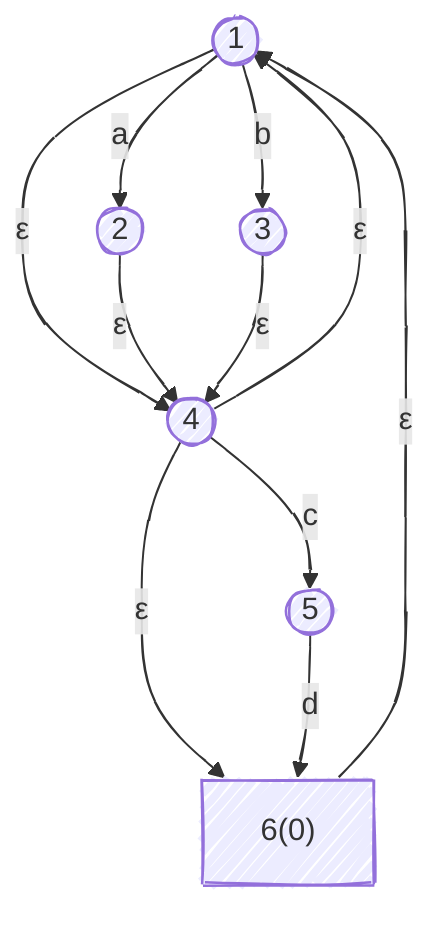

```mermaid
---
  config:
    look: handDrawn
---
graph TD
1-->|"a"|2
1-->|"b"|3
1-->|"ε"|4
2-->|"ε"|4
3-->|"ε"|4
4-->|"ε"|1
4-->|"ε"|6
4-->|"c"|5
5-->|"d"|6
6-->|"ε"|1
1((1))
2((2))
3((3))
4((4))
5((5))
6["6(0)"]
```
