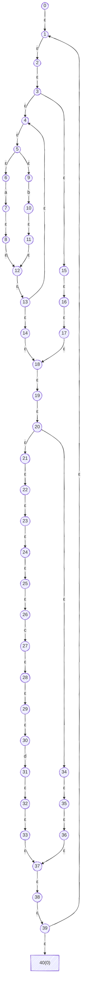

```mermaid
---
  config:
    look: handDrawn
---
graph TD
0-->|"ε"|1
1-->|"ε"|2
2-->|"ε"|3
3-->|"ε"|4
3-->|"ε"|15
4-->|"ε"|5
5-->|"ε"|6
5-->|"ε"|9
6-->|"a"|7
7-->|"ε"|8
8-->|"ε"|12
9-->|"b"|10
10-->|"ε"|11
11-->|"ε"|12
12-->|"ε"|13
13-->|"ε"|4
13-->|"ε"|14
14-->|"ε"|18
15-->|"ε"|16
16-->|"ε"|17
17-->|"ε"|18
18-->|"ε"|19
19-->|"ε"|20
20-->|"ε"|21
20-->|"ε"|34
21-->|"ε"|22
22-->|"ε"|23
23-->|"ε"|24
24-->|"ε"|25
25-->|"ε"|26
26-->|"c"|27
27-->|"ε"|28
28-->|"ε"|29
29-->|"ε"|30
30-->|"d"|31
31-->|"ε"|32
32-->|"ε"|33
33-->|"ε"|37
34-->|"ε"|35
35-->|"ε"|36
36-->|"ε"|37
37-->|"ε"|38
38-->|"ε"|39
39-->|"ε"|1
39-->|"ε"|40
0((0))
1((1))
2((2))
3((3))
4((4))
5((5))
6((6))
7((7))
8((8))
9((9))
10((10))
11((11))
12((12))
13((13))
14((14))
15((15))
16((16))
17((17))
18((18))
19((19))
20((20))
21((21))
22((22))
23((23))
24((24))
25((25))
26((26))
27((27))
28((28))
29((29))
30((30))
31((31))
32((32))
33((33))
34((34))
35((35))
36((36))
37((37))
38((38))
39((39))
40["40(0)"]
```
